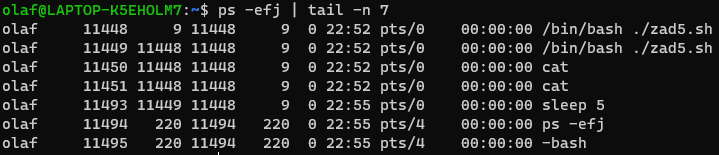
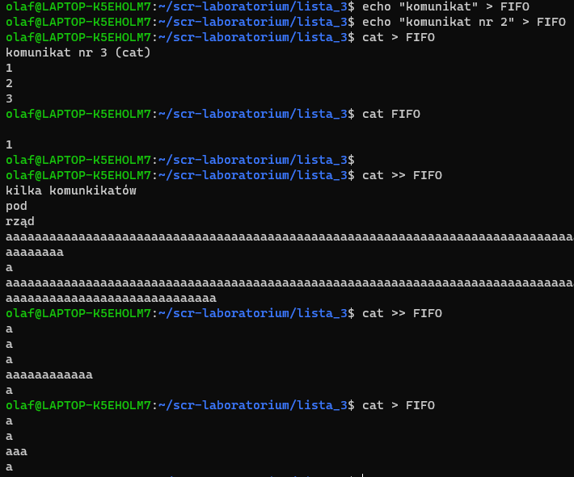
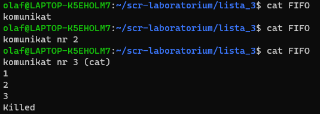
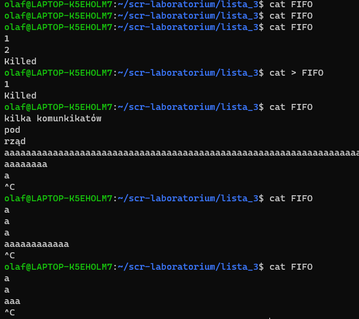
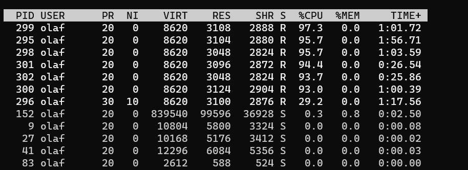

## Sprawozdanie lista nr 2

# Zadanie 1

```bash
#!/bin/bash
pgrep sshd > result.txt
wc -w result.txt
```

# Zadanie 2

### Kod trzech skryptów do zadania 2

```bash
#!/bin/bash
sleep 100
```

```bash
#!/bin/bash
./zad2a.sh &
sleep 100
```

```bash
#!/bin/bash
./zad2b.sh &
sleep 100
```

# Zadanie 3

```bash
#!/bin/bash
while :
do
	sleep 2
	date
	trap 'echo "Signal blocked" ' 1 2 3 4 5 6 7 8 9 10 11 12 13 14 15
done
```


# Zadanie 4

```bash
#!/bin/bash
while :
do
	sleep 4
	date
done
```


>SIGCONT w swoim działąniu bardziej przypomina polecenie bg.

# Zadanie 5

```bash
#!/bin/bash
while true
do
    echo "Komunikat"
    sleep 5
done | cat | cat
```

>Po uruchomieniu powyższego skryptu i sprawdzeniu pokrewieństwa procesów na podstawie ich PID i PPID stwierdzamy, że proces /bin/bash ./zad5.sh jest rodzicem procesów cat wywoływanych w potoku.



#Zadanie 6

>Pierwszeństwo w czytaniu z potoku ma pierwszy zainicjowany jako czytający go program. Reszta w odpowiedniej kolejności czeka, aż procesy będące pierwsze w kolejce skończą prace (czytanie z potoku). Kiedy proces piszący do potoku zakończy swoją prace, wszystkie procesy go czytające również zostaną zakończone. Podobnie, gdy proces po operacji pisania do potoku zobaczy, że procesy go czytające zakończyły prace, on również ją zakończy. Komuniakty były generwowane poprzez przekazanie STDIO programu cat do FIFO (> >>).





#Zadanie 7

```bash
./zad7.sh &
nice ./zad7.sh -n 10 &
top -u olaf
```

Za pomocą powyższych komend na komputerze odpalono 7 instancji skryptu zad7.sh w tym jedną z obniżonym priorytetem. Poleceniem top sprawdzono hierarchie przydzielania dostępu do CPU i zgodnie z oczekiwaniami zaobserwowano, że proces o obniżonym priorytecie ma do ich dyspozycji najmniej.



#Zadanie 8

```bash
obiegans@panamint:~/SCR_lab_sem5/SCR_LAB_sr19/lista_3$ ulimit -u 2
obiegans@panamint:~/SCR_lab_sem5/SCR_LAB_sr19/lista_3$ ls
-bash: fork: retry: Resource temporarily unavailable
-bash: fork: retry: Resource temporarily unavailable
-bash: fork: retry: Resource temporarily unavailable
obiegans@panamint:~/SCR_lab_sem5/SCR_LAB_sr19/lista_3$ ulimit -u 3
-bash: ulimit: max user processes: cannot modify limit: Operation not permitted
-bash: wait_for: No record of process 1133716
obiegans@panamint:~/SCR_lab_sem5/SCR_LAB_sr19/lista_3$ killall ls
-bash: fork: retry: Resource temporarily unavailable
-bash: fork: retry: Resource temporarily unavailable
obiegans@panamint:~/SCR_lab_sem5/SCR_LAB_sr19/lista_3$ ulimit -Hu 10
-bash: ulimit: max user processes: cannot modify limit: Operation not permitted
```

Początkowo ustawiono limit na maksymalnie dwa procesy. Zaskutkowało to brakiem mozliwości wykonania polecenia ls. Po obniżeniu limitu nie istniała również mozliwośc ponownego go zwiększenia. Prawdopodopnie konieczne są do tego uprawnienia superuser. Po wylogowaniu i ponownym zalogowaniu ustawienia ulimit wróciły do domyślnych.

```bash
obiegans@panamint:~$ ulimit -a
real-time non-blocking time  (microseconds, -R) unlimited
core file size              (blocks, -c) 0
data seg size               (kbytes, -d) unlimited
scheduling priority                 (-e) 0
file size                   (blocks, -f) unlimited
pending signals                     (-i) 1031153
max locked memory           (kbytes, -l) 33009433
max memory size             (kbytes, -m) unlimited
open files                          (-n) 1024
pipe size                (512 bytes, -p) 8
POSIX message queues         (bytes, -q) 819200
real-time priority                  (-r) 0
stack size                  (kbytes, -s) 8192
cpu time                   (seconds, -t) unlimited
max user processes                  (-u) 500
virtual memory              (kbytes, -v) unlimited
file locks                          (-x) unlimited
```
Następnie zmniejszono limit do 50 procesów i uruchomiono skrypt zad8.sh. W celu zatrzymania procesów należało wysłać sygnał kończący wszystkie procesy (kill -9 -1).

```bash
#!/bin/bash
while true
do
	./zad8.sh &
done
```
